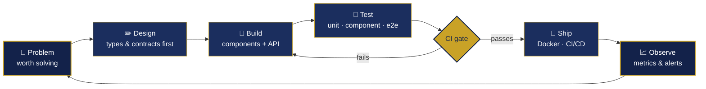
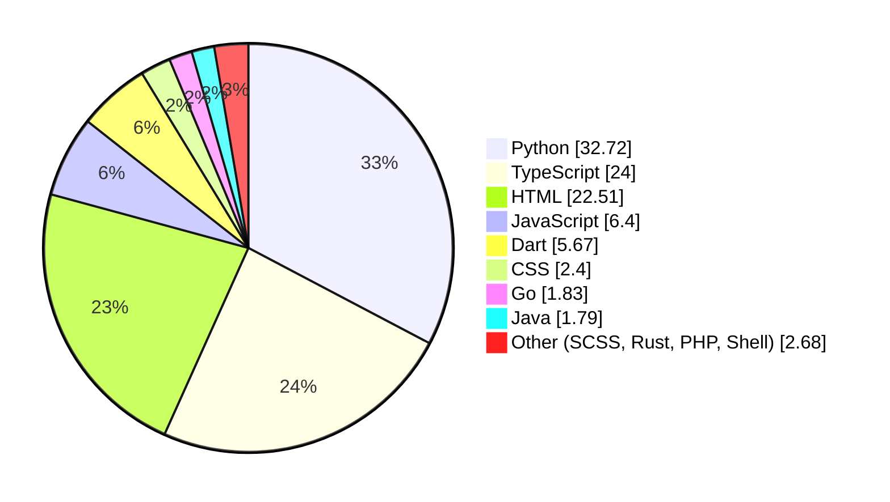

<div align="center">

# Victor Mbugua

**Software Engineer · Nairobi, Kenya**

*I build production systems for a living and strange little languages for love.*

<p>
  <a href="https://victor-mbugua-portfolio.netlify.app/" target="_blank" rel="noreferrer">
    
  </a>
  <a href="https://www.linkedin.com/in/mbugua-kamande-a796bb156" target="_blank" rel="noreferrer">
    
  </a>
  <a href="mailto:kamandembugua18@gmail.com" target="_blank" rel="noreferrer">
    
  </a>
  <a href="https://github.com/blackswanalpha?tab=repositories" target="_blank" rel="noreferrer">
    
  </a>
</p>

</div>

---

## Hello 👋

I'm a full-stack engineer working across **Python (Django, FastAPI)**, **TypeScript (React, Next.js)**,
**Go**, **Rust** and **Flutter** — mostly on multi-tenant SaaS, payment rails and the kind of internal
platforms that quietly hold a business together.

The short version: **I like the boring parts done properly and the interesting parts done playfully.**
Typed contracts, tests that gate CI, accessible interfaces, containers that come back up on their own —
and then, once that's solid, a terminal emulator with an AI agent in it, or a programming language
written for the sheer pleasure of watching a parser click into place.

I hold a **BSc in Information Technology (JKUAT)** and a **DevOps Engineering certification (Moringa, 2025)**,
which is a formal way of saying I can build the thing *and* keep it running at 2am.

```text
by day    →  loan origination platforms, payment protocols, multi-tenant school systems
by night  →  a toy language, an x86_64 kernel in Rust, an offline-first finance app
always    →  coffee, good typography, and one more refactor
```

### 🔭 Currently building

**TimeBox** · **SharePlay** · **SpinWish** · **mintyAI** — and steadily improving whatever I shipped last month.

---

## Shipped & Live

| Project | What it is | Where |
|---|---|---|
| **CentraQu / AssureHub** | Audit, compliance and workflow automation | [app.centraqu.net](https://app.centraqu.net/) |
| **Barberian Spa** | Booking and salon operations *(agentic engineering)* | [barberianspa.com](https://www.barberianspa.com/home/) |
| **SharePlay** | Synchronised watch parties over WebSockets | [share.spinwish.tech](https://share.spinwish.tech/) |

---

### Languages & Tools

A clean, compact grid that groups common techs and links to their sites. Replace / expand icons below with your full set as needed.

<table>
  <tr>
    <td align="center">
      <a href="https://www.python.org" target="_blank" rel="noreferrer" title="Python">
        
        <div>Python</div>
      </a>
    </td>
    <td align="center">
      <a href="https://www.djangoproject.com/" target="_blank" rel="noreferrer" title="Django">
        
        <div>Django</div>
      </a>
    </td>
    <td align="center">
      <a href="https://fastapi.tiangolo.com/" target="_blank" rel="noreferrer" title="FastAPI">
        
        <div>FastAPI</div>
      </a>
    </td>
    <td align="center">
      <a href="https://www.postgresql.org" target="_blank" rel="noreferrer" title="PostgreSQL">
        
        <div>Postgres</div>
      </a>
    </td>
    <td align="center">
      <a href="https://www.docker.com/" target="_blank" rel="noreferrer" title="Docker">
        
        <div>Docker</div>
      </a>
    </td>
    <td align="center">
      <a href="https://kubernetes.io" target="_blank" rel="noreferrer" title="Kubernetes">
        
        <div>K8s</div>
      </a>
    </td>
    <td align="center">
      <a href="https://reactjs.org/" target="_blank" rel="noreferrer" title="React">
        
        <div>React</div>
      </a>
    </td>
    <td align="center">
      <a href="https://nextjs.org/" target="_blank" rel="noreferrer" title="Next.js">
        
        <div>Next.js</div>
      </a>
    </td>
    <td align="center">
      <a href="https://www.typescriptlang.org/" target="_blank" rel="noreferrer" title="TypeScript">
        
        <div>TypeScript</div>
      </a>
    </td>
    <td align="center">
      <a href="https://nodejs.org" target="_blank" rel="noreferrer" title="Node.js">
        
        <div>Node.js</div>
      </a>
    </td>
  </tr>

  <tr>
    <td align="center">
      <a href="https://www.electronjs.org" target="_blank" rel="noreferrer" title="Electron">
        
        <div>Electron</div>
      </a>
    </td>
    <td align="center">
      <a href="https://www.postman.com" target="_blank" rel="noreferrer" title="Postman">
        
        <div>Postman</div>
      </a>
    </td>
    <td align="center">
      <a href="https://pandas.pydata.org/" target="_blank" rel="noreferrer" title="Pandas">
        
        <div>Pandas</div>
      </a>
    </td>
    <td align="center">
      <a href="https://pytorch.org/" target="_blank" rel="noreferrer" title="PyTorch">
        
        <div>PyTorch</div>
      </a>
    </td>
    <td align="center">
      <a href="https://www.tensorflow.org" target="_blank" rel="noreferrer" title="TensorFlow">
        
        <div>TensorFlow</div>
      </a>
    </td>
    <td align="center">
      <a href="https://redis.io" target="_blank" rel="noreferrer" title="Redis">
        
        <div>Redis</div>
      </a>
    </td>
    <td align="center">
      <a href="https://www.mysql.com/" target="_blank" rel="noreferrer" title="MySQL">
        
        <div>MySQL</div>
      </a>
    </td>
    <td align="center">
      <a href="https://www.mongodb.com/" target="_blank" rel="noreferrer" title="MongoDB">
        
        <div>MongoDB</div>
      </a>
    </td>
    <td align="center">
      <a href="https://www.java.com" target="_blank" rel="noreferrer" title="Java">
        
        <div>Java</div>
      </a>
    </td>
    <td align="center">
      <a href="https://developer.mozilla.org/en-US/docs/Web/JavaScript" target="_blank" rel="noreferrer" title="JavaScript">
        
        <div>JavaScript</div>
      </a>
    </td>
  </tr>

  <tr>
    <td align="center">
      <a href="https://www.w3.org/html/" target="_blank" rel="noreferrer" title="HTML5">
        
        <div>HTML5</div>
      </a>
    </td>
    <td align="center">
      <a href="https://www.w3.org/Style/CSS/Overview.en.html" target="_blank" rel="noreferrer" title="CSS3">
        
        <div>CSS3</div>
      </a>
    </td>
    <td align="center">
      <a href="https://www.cprogramming.com/" target="_blank" rel="noreferrer" title="C">
        
        <div>C</div>
      </a>
    </td>
    <td align="center">
      <a href="https://www.w3schools.com/cpp/" target="_blank" rel="noreferrer" title="C++">
        
        <div>C++</div>
      </a>
    </td>
    <td align="center">
      <a href="https://www.w3schools.com/cs/" target="_blank" rel="noreferrer" title="C#">
        
        <div>C#</div>
      </a>
    </td>
    <td align="center">
      <a href="https://golang.org" target="_blank" rel="noreferrer" title="Go">
        
        <div>Go</div>
      </a>
    </td>
    <td align="center">
      <a href="https://www.rust-lang.org" target="_blank" rel="noreferrer" title="Rust">
        
        <div>Rust</div>
      </a>
    </td>
    <td align="center">
      <a href="https://kafka.apache.org/" target="_blank" rel="noreferrer" title="Kafka">
        
        <div>Kafka</div>
      </a>
    </td>
    <td align="center">
      <a href="https://www.nginx.com" target="_blank" rel="noreferrer" title="Nginx">
        
        <div>Nginx</div>
      </a>
    </td>
    <td align="center">
      <a href="https://www.linux.org/" target="_blank" rel="noreferrer" title="Linux">
        
        <div>Linux</div>
      </a>
    </td>
  </tr>

  <tr>
    <td align="center">
      <a href="https://developer.android.com" target="_blank" rel="noreferrer" title="Android">
        
        <div>Android</div>
      </a>
    </td>
    <td align="center">
      <a href="https://angular.io" target="_blank" rel="noreferrer" title="Angular">
        
        <div>Angular</div>
      </a>
    </td>
    <td align="center">
      <a href="https://www.gnu.org/software/bash/" target="_blank" rel="noreferrer" title="Bash">
        
        <div>Bash</div>
      </a>
    </td>
    <td align="center">
      <a href="https://getbootstrap.com" target="_blank" rel="noreferrer" title="Bootstrap">
        
        <div>Bootstrap</div>
      </a>
    </td>
    <td align="center">
      <a href="https://www.chartjs.org" target="_blank" rel="noreferrer" title="Chart.js">
        
        <div>Chart.js</div>
      </a>
    </td>
    <td align="center">
      <a href="https://d3js.org/" target="_blank" rel="noreferrer" title="D3.js">
        
        <div>D3.js</div>
      </a>
    </td>
    <td align="center">
      <a href="https://www.figma.com/" target="_blank" rel="noreferrer" title="Figma">
        
        <div>Figma</div>
      </a>
    </td>
    <td align="center">
      <a href="https://firebase.google.com/" target="_blank" rel="noreferrer" title="Firebase">
        
        <div>Firebase</div>
      </a>
    </td>
    <td align="center">
      <a href="https://flask.palletsprojects.com/" target="_blank" rel="noreferrer" title="Flask">
        
        <div>Flask</div>
      </a>
    </td>
    <td align="center">
      <a href="https://flutter.dev" target="_blank" rel="noreferrer" title="Flutter">
        
        <div>Flutter</div>
      </a>
    </td>
  </tr>
</table>

---

## Featured Work

> Repositories are public unless noted. Happy to walk through any of them.

**🏦 [lendora](https://github.com/blackswanalpha/lendora)** — Loan origination platform covering the full
lifecycle from lead capture through underwriting to disbursement. 238 App Router routes and 11 nested
layouts across four role-specific portals, Redux Toolkit for shared state, Radix UI underneath every
dialog and form control.
`Next.js 16 · React 19 · TypeScript · Redux Toolkit · Tailwind`

**💸 [paylink](https://github.com/blackswanalpha/paylink)** — The PayLink protocol: non-custodial payment
coordination that links any rail (M-Pesa, card, bank, on-chain) to settlement logic. The frontend leans
hard on the failure paths — error boundaries with recovery, offline detection, optimistic updates that
roll back, retry with backoff — with 31 React Testing Library suites gated in CI.
`Next.js 16 · React 19 · TypeScript · Zustand · Go · Python · Vitest`

**🧠 [mindtrack](https://github.com/blackswanalpha/mindtrack)** — Questionnaire design, distribution,
scoring and multi-organisation reporting for mental-health practitioners. 54 App Router routes and 108
components, tested with Jest, React Testing Library and Playwright.
`Next.js 15 · React 19 · TypeScript · Tailwind · Playwright`

**🖥️ [minty](https://github.com/blackswanalpha/minty)** — A cross-platform terminal emulator with AI agent
tooling built in for codebase analysis and developer workflows.
`Electron · React 19 · TypeScript · Zustand`

**🦀 [willo-main](https://github.com/blackswanalpha/willo-main)** — An x86_64 kernel written in Rust,
because at some point you want to know what is actually underneath everything else.
`Rust · bare metal`

**🚗 [xuperbadminapp](https://github.com/blackswanalpha/xuperbadminapp)** — Car rental and garage
management across 70 App Router routes, with digital contracts, e-signatures, fleet tracking and invoicing.
`Next.js 16 · React 19 · TypeScript · Radix UI`

**📊 [topdeck](https://github.com/blackswanalpha/topdeck)** — Desktop system monitor pulling live CPU,
memory, disk and sensor metrics into dashboards with threshold alerting, on a plugin architecture.
`Python · PyQt6 · SQLAlchemy`

**🔤 [mono](https://github.com/blackswanalpha/mono)** — A programming language. Written for the joy of it.
`Python`

<sub>Also: <a href="https://github.com/blackswanalpha/guardtrack">guardtrack</a> (geofenced attendance, Flutter) ·
<a href="https://github.com/blackswanalpha/shareplay">shareplay</a> (realtime watch parties) ·
<a href="https://github.com/blackswanalpha/hivemind-main">hivemind-main</a> (Rust) ·
<a href="https://github.com/blackswanalpha/learnium">learnium</a> (multi-tenant school SaaS) ·
<a href="https://github.com/blackswanalpha/globalcool">globalcool</a> (HVAC services platform)</sub>

---

## How I Build

Same shape on almost every project — the discipline is what makes the playful parts affordable.



**What that means in practice**

| Layer | How I approach it |
|---|---|
| **Rendering** | SSG for pages identical to everyone · ISR for scheduled content · SSR + server components for per-user data · client components behind Suspense for interaction |
| **State** | Zustand, Redux Toolkit, TanStack Query or Context — chosen by fit, never by default |
| **Accessibility** | WCAG 2.1 AA as a build standard: semantics, ARIA, keyboard reach, focus traps, `prefers-reduced-motion` |
| **Testing** | Playwright end-to-end, React Testing Library for components and hooks, gated in CI |
| **Security** | XSS escaping, CSP headers, httpOnly cookies, deliberate token storage, schema validation at every boundary |
| **Delivery** | Docker, GitHub Actions, AWS — if I built it, I can keep it running |

---

## By the Numbers

<div align="center">

| | |
|---|---|
| **66** public repositories | **11** languages leading a project |
| **~70 MB** of source across them | **Building since 2019** |

</div>

### Language mix

Measured across all 66 public repositories, by bytes of source.



Python and TypeScript carry the production work; Dart is Flutter; Go and Rust are where the
systems-level curiosity goes. The HTML share is mostly generated template output, not hand-written.

<div align="center">

<picture>
  <source media="(prefers-color-scheme: dark)" srcset="https://streak-stats.demolab.com/?user=blackswanalpha&hide_border=true&theme=tokyonight&ring=C9A227&fire=C9A227&currStreakLabel=C9A227">
  
</picture>

<picture>
  <source media="(prefers-color-scheme: dark)" srcset="https://github-readme-activity-graph.vercel.app/graph?username=blackswanalpha&theme=tokyo-night&hide_border=true&line=C9A227&point=ffffff">
  
</picture>

</div>

---

## Working Together

- **Found a bug?** Open an issue with reproduction steps and logs — that alone gets it fixed twice as fast.
- **Want a feature?** Open an issue tagged `enhancement` and tell me the problem, not just the solution.
- **Want to build something?** Email me. I read everything.

I'm open to backend, full-stack and frontend work, and I'm always glad to talk through an architecture
problem even if nothing comes of it.

---

<div align="center">

### A little flair

**Coffee-fuelled** ☕ · **perpetual learner** 📚 · **collector of half-finished compilers** 🔤

I'm happiest blending domains — a UI that feeds a neural net, a game that debugs my sleep schedule,
a kernel written on weekends. Every project gets a little tech and a little fun; no two are alike.

**📬 [Portfolio](https://victor-mbugua-portfolio.netlify.app/) · [LinkedIn](https://www.linkedin.com/in/mbugua-kamande-a796bb156) · [kamandembugua18@gmail.com](mailto:kamandembugua18@gmail.com)**

*Thanks for stopping by — pull requests, issues and good arguments all welcome.*

</div>
